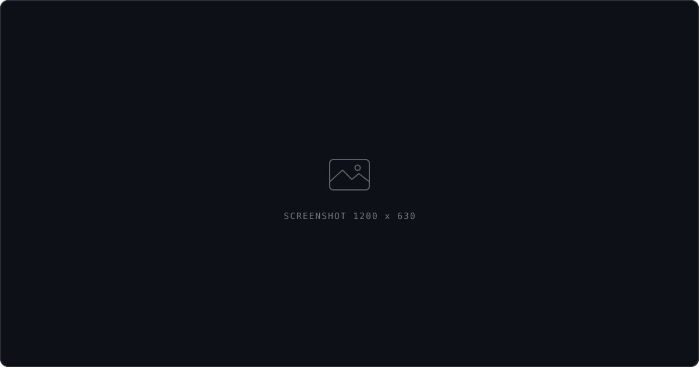

<!-- ────────────────────────────────────────────────────────────────
     Rebuild the SVGs after any edit:  sh build.sh
     Setup + checklist: SETUP.md
     ──────────────────────────────────────────────────────────── -->

<picture>
  <source media="(prefers-color-scheme: dark)" srcset="assets/hero.svg">
  <source media="(prefers-color-scheme: light)" srcset="assets/hero-light.svg">
  
</picture>

  

## About

I'm a computer science senior at Penn State who spends most of his time on **machine learning
and the systems around it** — the data pipeline, the API, the interface someone actually opens.
The model is usually the easy part.

- **I like problems where the data is messy.** Clean benchmarks don't teach you much.
- **Ship it, then judge it.** A rough version in someone's hands beats a perfect notebook.
- **Readable beats impressive.** Code I can't follow in a month is code I got wrong.

<table>
<tr>
<td width="50%" valign="top">

**Building** — HydroNode, plus a couple of AI projects in early stages.

</td>
<td width="50%" valign="top">

**Learning** — retrieval-augmented generation, model evaluation, and how to make inference cheap.

</td>
</tr>
</table>

## Stack

<picture>
  <source media="(prefers-color-scheme: dark)" srcset="assets/stack.svg">
  <source media="(prefers-color-scheme: light)" srcset="assets/stack-light.svg">
  
</picture>

## Selected Work

<!-- ── HydroNode is real. Replace DESCRIBE_HYDRONODE with what it actually does. ── -->

<table>
<tr>
<td width="42%" valign="top">
  
</td>
<td width="58%" valign="top">

### HydroNode

**DESCRIBE_HYDRONODE — what it is, in one sentence.**

DESCRIBE_THE_PROBLEM it solves, and how it goes about it.

`Python` · `TECH` · `TECH`

[Repository](https://github.com/aadycm/hydronode)

</td>
</tr>
</table>

<!-- ── The two below are drafts for projects that don't exist yet.
     Build them, then add the repo links. Until then they describe intent,
     not achievement — no metrics, no stars, nothing claimed. ── -->

<table>
<tr>
<td width="58%" valign="top">

### Semantic Notes

**A local-first note app that answers questions about your own notes.**

Search fails when you can't remember the words you used. This embeds every note on the
device, then answers plain questions against them — no cloud round-trip, no notes leaving
the machine.

`Python` · `FastAPI` · `Sentence Transformers` · `SQLite`

In progress

</td>
<td width="42%" valign="top">
  
</td>
</tr>
</table>

<table>
<tr>
<td width="42%" valign="top">
  
</td>
<td width="58%" valign="top">

### Paper Trail

**Turns a reading list of ML papers into a map of what actually connects.**

Reading fifty papers leaves you with fifty summaries and no structure. This pulls out each
paper's claims and citations, then builds a graph showing which results depend on which —
so you can see where a line of work actually holds up.

`Python` · `PyTorch` · `React` · `Neo4j`

In progress

</td>
</tr>
</table>

<a href="https://github.com/aadycm?tab=repositories">All repositories →</a>

## Activity

## How I Work

> **Simple beats clever.** The best PR is usually the one that deletes code.
>
> **Ship to learn.** Real users find the flaws a spec never will.
>
> **Leave it readable.** Someone maintains this at 3am. Probably me.

<picture>
  <source media="(prefers-color-scheme: dark)" srcset="assets/cta.svg">
  <source media="(prefers-color-scheme: light)" srcset="assets/cta-light.svg">
  
</picture>

 

**[Email](mailto:aadycm05@gmail.com)** · **[GitHub](https://github.com/aadycm)**

